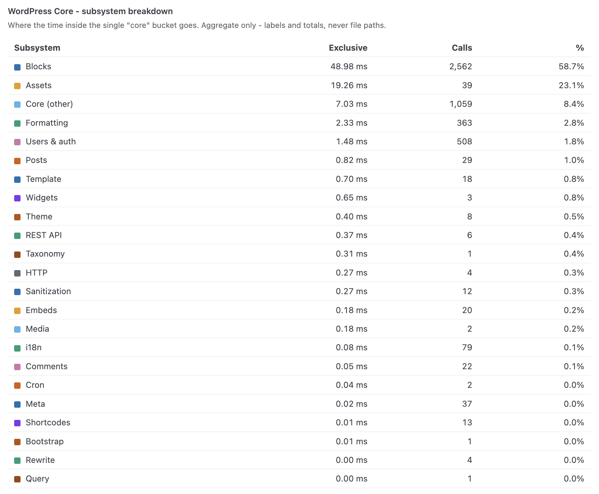
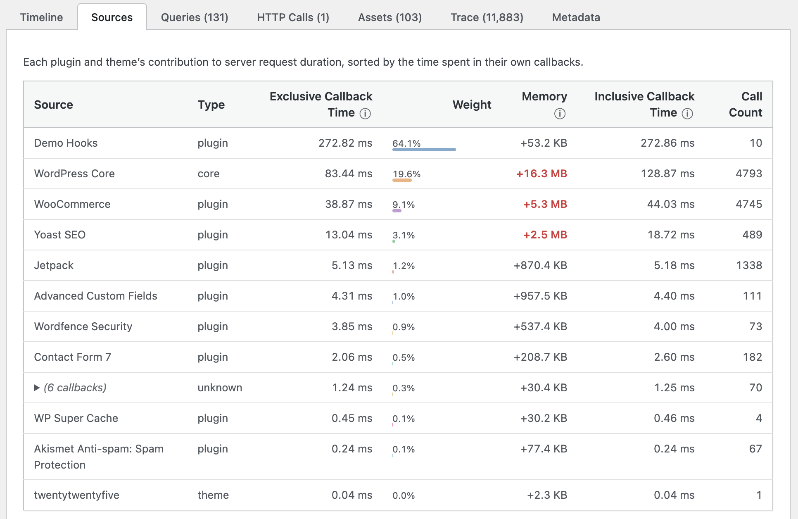
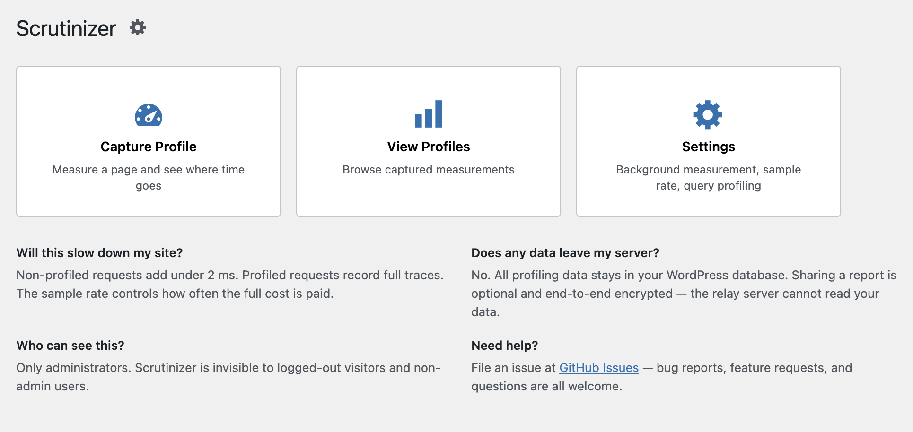
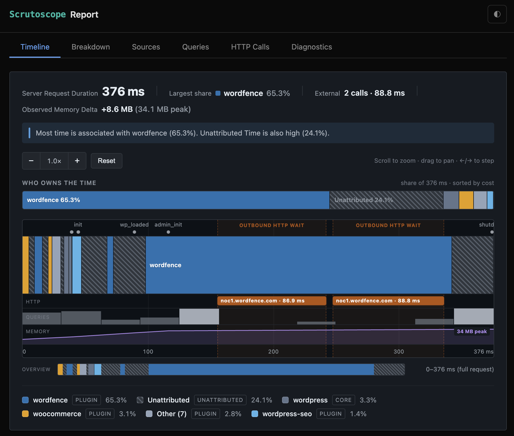

# Scrutoscope

**WordPress Performance Profiler. See where your server request duration is spent.**

Scrutoscope is a read-only profiling plugin for WordPress. It instruments hook callbacks during a page request and attributes time to its source: plugin, theme, core, mu-plugin, or drop-in. You can see which plugin costs the most, which queries are heavy, which HTTP calls block the response, and where WordPress itself is spending time.

> By Kurt Payne, author of [P3 (Plugin Performance Profiler)](https://wordpress.org/plugins/p3-profiler/). Scrutoscope is the spiritual successor, rebuilt from scratch for modern WordPress with real attribution, SQL analysis, route history, encrypted report sharing, and no premium tier.

## Live demo

No install required. Open an encrypted sample report in your browser:

[Open the live report](https://scrutoscope.dev/r/546fcfa0afddae3b7544337c41028564#pa0IKnGUwGl_InDSTgLVtZM_sLbwsxxhtCjHHx3Kz7A)

The sample is a WooCommerce cart page with 12 active plugins and 544 ms of server time, broken down to the callback. The report is encrypted and decrypted entirely in your browser. The relay server never sees the contents.



## What it measures

| What | How |
|------|-----|
| **Server Request Duration** | Total wall-clock time for the PHP request |
| **Source Attribution** | Hook callbacks traced to plugin, theme, core, mu-plugin, or drop-in with exclusive and inclusive timing |
| **Database Queries** | Query text reduced to safe patterns, execution time, caller, and source |
| **HTTP Calls** | External request destination host only, with paths and query strings stripped, plus duration, response code, and blocking vs. async state |
| **Autoloaded Options** | Option names, sizes, and sources contributing to autoload bloat |
| **Enqueued Assets** | Scripts and stylesheets with sizes and dependency chains |
| **Hook Execution Trace** | Callback tree by WordPress lifecycle phase |
| **Timeline** | Request timeline with ownership bar, phase markers, HTTP and query-density lanes, and memory curve |

## Key features

- Background capture with configurable sample rate from 0.1% to 100%. Off by default.
- Route-based grouping with human-readable labels and status code breakdown.
- Pin and annotate profiles with notes and tags.
- Automatic retention with TTL plus per-route cap. Pinned profiles are exempt.
- Cron inventory and on-demand cron profiling.
- Seven read-only REST API endpoints for coding-agent workflows.
- Send to Agent: one-click prompt with short-lived, read-only credentials.
- Send to Support: zero-knowledge encrypted sharing through [scrutoscope.dev](https://scrutoscope.dev).
- WP-CLI: `wp scrutoscope status|list|show|delete|export|clear|rebuild-stats|mu-plugin`.

## Screenshots








## Requirements

- WordPress 7.0+
- PHP 7.4+

## Installation

### From WordPress.org

1. In WordPress admin, go to **Plugins → Add New**.
2. Search for **Scrutoscope**.
3. Install and activate.
4. Open **Tools → Scrutoscope**.

Background measurement is optional and **off by default**. To capture a profile, open Tools → Scrutoscope and start a profiling session, or enable background measurement with a sample rate you choose.

### From GitHub release

1. Download the latest `.zip` from [Releases](https://github.com/scrutineerhq/scrutoscope/releases).
2. In WordPress admin, go to **Plugins → Add New → Upload Plugin**.
3. Upload the zip and activate.

### From source

```bash
git clone https://github.com/scrutineerhq/scrutoscope.git
cd scrutoscope
composer install --no-dev
```

Copy or symlink the `scrutoscope` directory into `wp-content/plugins/`.

## REST API

Scrutoscope exposes seven read-only REST endpoints under `wp-json/scrutoscope/`:

| Method | Endpoint | Description |
|--------|----------|-------------|
| `GET` | `/v1/prompt` | System prompt and API contract as `text/plain` |
| `GET` | `/v1/diagnostics` | Site fingerprint with opt-in fields |
| `GET` | `/v1/routes` | Profiled routes with summary stats |
| `GET` | `/v1/regression` | Regression detection for a route |
| `GET` | `/v1/profile/{id}` | Full compiled profile |
| `GET` | `/v1/compare/{a}/{b}` | Two profiles with deltas |
| `GET` | `/v1/manifest` | Plugin capabilities manifest |

Authentication uses WordPress Application Passwords. The **Send to Agent** button generates a short-lived credential automatically.

## Encrypted sharing

Share a performance report with a support team or plugin developer:

1. Open a profile from the **History** tab.
2. Click **Share** in the toolbar.
3. Choose expiry, sections to include, and optional passphrase.
4. Click **Encrypt & Share**.

The report is encrypted in your browser with AES-256-GCM before upload. The relay server at `scrutoscope.dev` stores only ciphertext it cannot read. The decryption key lives in the URL fragment (`#key`) and never leaves your browser. Links are revocable and auto-expire.

## Design philosophy

- **Read-only**: Scrutoscope measures. It never modifies your content, themes, plugins, or site behavior.
- **Off until asked**: Background measurement, query profiling, and early-boot timing are all opt-in.
- **Data first**: The dashboard leads with profiling data, not settings.
- **WordPress native**: Standard admin patterns.
- **Privacy by design**: No telemetry. SQL is reduced to safe patterns. Outbound HTTP URLs are reduced to scheme and host. Sharing is opt-in and encrypted.
- **Open source**: GPL-2.0-or-later, no obfuscated code, no premium tier.

## Links

- [scrutoscope.dev](https://scrutoscope.dev) — Project home
- [About Scrutoscope](https://scrutoscope.dev/about) — Project story
- [WordPress.org](https://wordpress.org/plugins/scrutoscope/) — Plugin listing
- [Live demo](https://scrutoscope.dev/r/546fcfa0afddae3b7544337c41028564#pa0IKnGUwGl_InDSTgLVtZM_sLbwsxxhtCjHHx3Kz7A) — Encrypted sample report
- [GitHub issues](https://github.com/scrutineerhq/scrutoscope/issues) — Bug reports and feature requests
- Email: hello@scrutineer.dev
- [GitHub](https://github.com/scrutineerhq/scrutoscope) — Source

## Contributing

Contributions are welcome. See [CONTRIBUTING.md](CONTRIBUTING.md) for guidelines.

## License

GPL-2.0-or-later. See [LICENSE](LICENSE).
